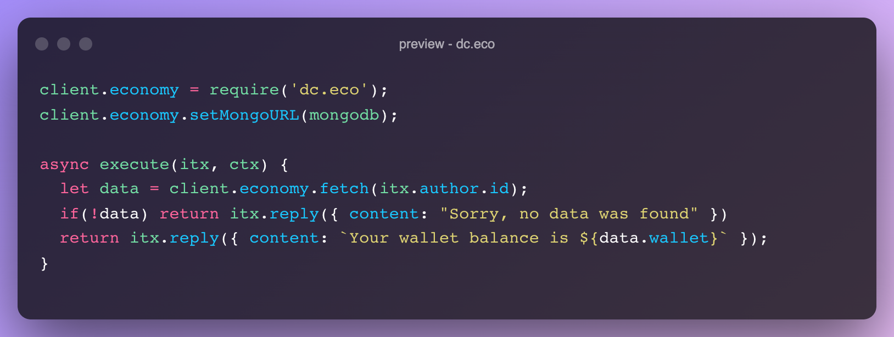

# 
 Discord Eco 

## 
 Documentation 

Documentation can be found on <a href="https://eco.wxifu.de" target="_blank">https://eco.wxifu.de</a>

## 
 Preview

 Additional previews can be found in the assets directory. 

## 
 Support

If you have any questions, issues or suggestions, feel free to open an issue on the GitHub repo.   If you're coming here from a discord server or similar, you can ask me in that server / the corresponding thread in that server.